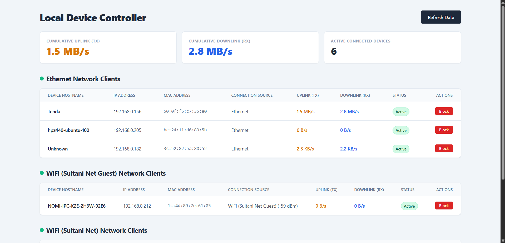

# OpenWrt User Devices Wifi and Ethernet MacFilter (CGI)

A lightweight, self-contained, single-file CGI script designed for OpenWrt to monitor, block, and shape the bandwidth of connected local devices. The interface is rendered dynamically using Tailwind CSS.




## Features

* **Dynamic Table Segregation:** Connected devices are automatically sorted into separate tables based on their connection interface (e.g., **Ethernet**, **WiFi (Sultani Net)**, etc.).
* **Real-time Speedometer:** Tracks active upload (TX) and download (RX) traffic rates per client in standard auto-scaled units (`B/s`, `KB/s`, `MB/s`) using a 1-second sampling window from the kernel's connection tracker.
* **Global Network Metrics:** Displays aggregate network statistics (Total Upload rate, Total Download rate, and Active Device Count) in a dashboard banner at the top of the page.
* **Layer 2 Wi-Fi Eviction (Method 1 Block):** Physically disconnects blacklisted devices by dynamically writing to the UCI wireless configuration blacklist (`maclist`) and reloading the Wi-Fi drivers.
* **Blocked Devices Repository:** Moves blocked/evicted devices to a dedicated table at the bottom of the page, keeping active device lists clean. It reads directly from `/etc/config/wireless`, allowing you to unblock offline devices.
* **Tenda-Inspired Dual Rate-Limiting:** Provides separate text input fields to set distinct download and upload bandwidth caps for each IP address (requires `tc-tiny`).
* **Dynamic UI Fallbacks:** If traffic shaping utilities (`tc`) are missing, the rate-limiting controls are automatically hidden from the interface without leaving broken inputs or placeholder text.
* **Zero-Dependency Backend:** Relies entirely on standard OpenWrt system utilities (`uci`, `ip neigh`, `iwinfo`, `iw`, `nftables`, `tc`, and `awk`) inside a standard `/bin/sh` shell environment.

---

## Prerequisites & Dependencies

To use all features of the manager, ensure the following packages are installed on your router:

```bash
opkg update
# Compatibility layer for nftables firewall
opkg install iptables-nft
# Optional: Required if you want the upload/download bandwidth limiting controls to display
opkg install tc-tiny kmod-sched-core
```

---

## Installation

### 1. Copy the Script

Copy the `manage` script from this repository into the `/www/cgi-bin/` directory on your router. You can do this via SCP/SFTP or by creating the file manually via SSH:

```bash
# Create the target file
nano /www/cgi-bin/manage
# (Paste the contents of the manage script and save)
```

### 2. Set Execution Permissions

For the webserver (`uhttpd`) to run the CGI script, you must grant it execution permissions:

```bash
chmod +x /www/cgi-bin/manage
```

### 3. Access the Dashboard

Open your web browser and navigate to:

```text
http://<your-router-ip>/cgi-bin/manage
```

---

## Security (Enable Password Protection)

By default, standalone CGI scripts are not protected by OpenWrt's LuCI login system. To prevent unauthorized users on your local network from accessing this management dashboard, you can enable **HTTP Basic Authentication** using `uhttpd`'s integrated access lists.

This configuration prompts the browser to show a secure login box. It will verify credentials against your router's actual system `root` password without requiring you to write your password in plain text.

### Enable Authentication

Run the following commands in your router's terminal:

```bash
# 1. Append the authentication rule to the webserver config file
# This maps the manage script to the "root" user and system password ($p$root)
echo "/cgi-bin/manage:root:\$p\$root" >> /etc/httpd.conf

# 2. Restart uhttpd to apply the authentication policy
/etc/init.d/uhttpd restart
```

*Note: When accessing the page after running these commands, your browser will prompt you for your username (`root`) and your router's administration password.*

---

## Troubleshooting

### Disconnected devices are still showing as "Ethernet"

If a Wi-Fi device disconnects, it may occasionally stay in the router's system ARP table as a `STALE` connection. The script is designed to ignore stale and failed neighbor states. If a ghost device persists, click **Refresh Data** on the top right to force the kernel to re-evaluate active Layer 2 links.

### The "Limit" buttons are not visible

The script automatically queries the availability of the `tc` command line utility. If the `tc-tiny` package is missing or unsupported on your current build, the inputs are omitted. To enable them, install `tc-tiny` and `kmod-sched-core` via your package manager.

### The page redirects to a "Status: 302 Found" text screen

If you are using an older custom modification of this script and see raw HTTP headers on screen, make sure that all query parameter handlers (`action=block`, `action=limit`, etc.) are placed at the absolute top of the `manage` file, **before** the `echo "Content-type: text/html"` header is printed.

---

## License

This project is open-source and licensed under the [MIT License](LICENSE).
